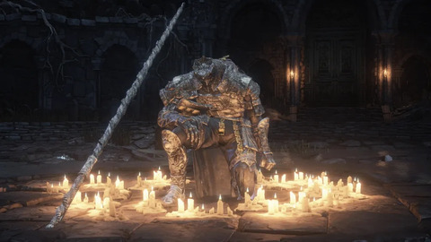

# 🧠 Dark Souls III RL Agent: Defeating Iudex Gundyr with Reinforcement Learning

This project implements a modular Reinforcement Learning (RL) framework that learns to defeat the boss **Iudex Gundyr** in *Dark Souls III* by simulating real keyboard inputs and reading game memory in real time.

Multiple agents are trained to handle different components of gameplay (movement, dodging, camera control, combat decisions), and these are integrated into a full combat loop using PPO and Q-learning.

---

## 🎥 Demo (It might take a moment to load...)

---

## 🎮 Core Features

- 🔁 **Modular Gym Environments** for:
  - Movement (`MoveEnv`)
  - Dodging (`DodgeEnv`)
  - Camera (`CamEnv`)
  - Lock-On system (`LockEnv`)
  - Combat Actions (`ActEnv`)
- 🤖 **Action Learning** using:
  - DQN (Stable-Baselines3) for movement, camera, lock, dodge, and combat policies
- 📦 **Real-time interaction** using:
  - `pydirectinput` to press keys
  - `pyMeow` & `pymem` for reading/writing game memory
- 📊 **Win-rate logging**, auto-reset, and fall prevention
- 💥 Trains and plays entirely in *real-time* on top of the game

---

## 🚀 Getting Started

### Requirements

- Python 3.10+
- Game: **Dark Souls III (PC)**
- [pyMeow](https://github.com/qb-0/pyMeow)
- `pymem`, `pydirectinput`, `stable-baselines3`, `gymnasium`, `numpy`, `torch`

### Setup

1. Clone this repo
2. Launch **Dark Souls III**, teleport to Iudex
3. Make sure offsets in `address.py` match your game version
4. Train or run the agent using provided scripts
